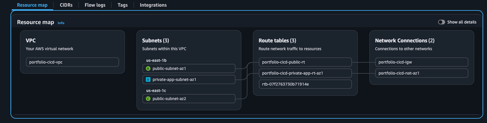
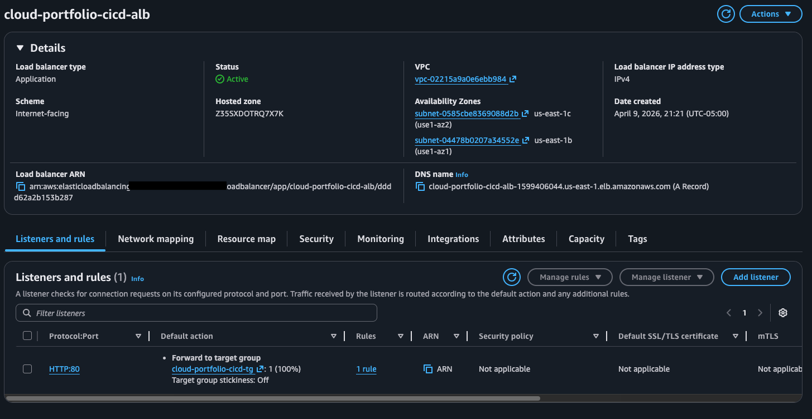
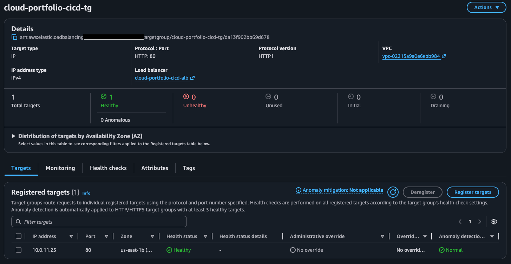
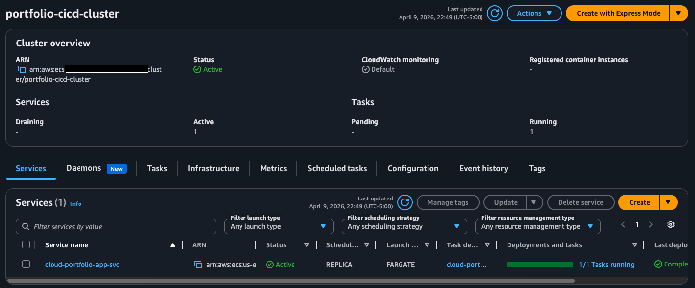
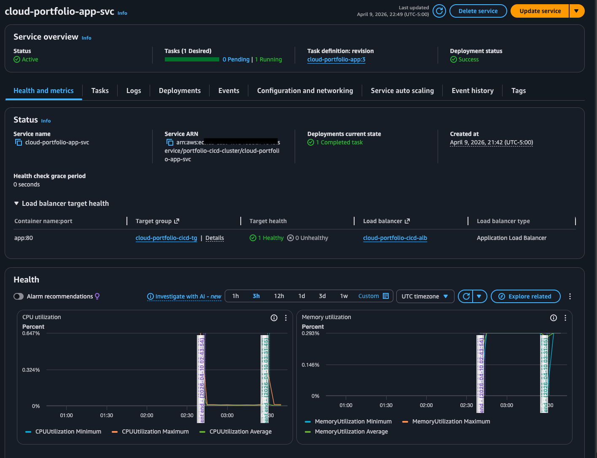
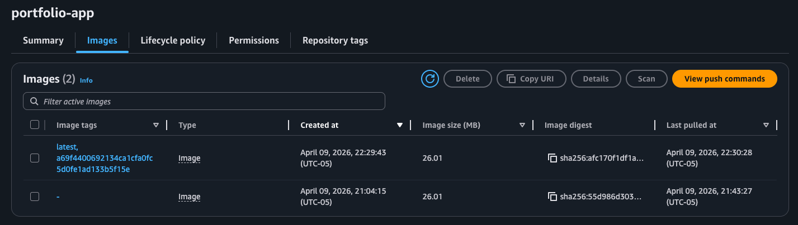
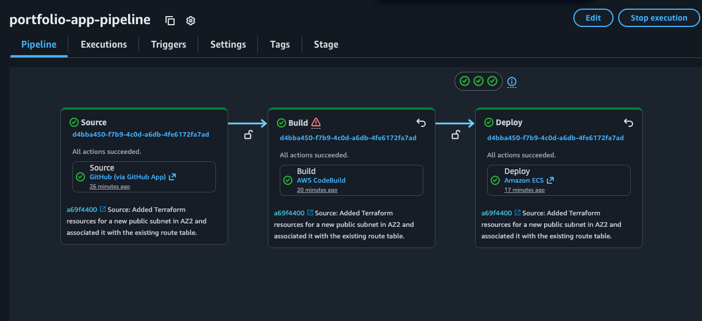
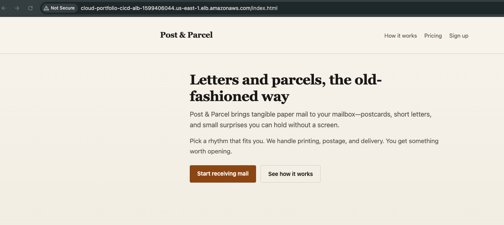

# AWS CI/CD Pipeline for Cloud Deployments

This project demonstrates an end-to-end CI/CD pipeline on AWS for deploying a containerized web application to Amazon ECS using GitHub, AWS CodePipeline, AWS CodeBuild, Amazon ECR, and an Application Load Balancer.

The goal of this project was to keep the architecture simple and focused on demonstrating the CI/CD workflow rather than building out a full highly available network platform. Because of that, I intentionally did **not** implement a full multi-AZ highly available application architecture for this version of the project.

For its scope, the project is **complete**: Terraform defines the full stack in this repository—from VPC, subnets, routing, and security groups through ECR, ECS, the ALB, CodePipeline, CodeBuild, the S3 artifact bucket for the pipeline, and the IAM needed for the pipeline and runtime.

---

## Project Overview

This pipeline automates the process of:

1. Pulling source code from GitHub
2. Building a Docker image with CodeBuild
3. Pushing the image to Amazon ECR
4. Deploying the updated container image to an ECS service
5. Serving traffic through an Application Load Balancer

This project helped me practice core cloud engineering concepts around:

- CI/CD automation
- containerized deployments
- AWS managed build and deployment services
- ECS service updates
- image versioning with ECR
- load balancer integration with ECS

---

## Architecture

**Workflow**

GitHub → CodePipeline → CodeBuild → Amazon ECR → Amazon ECS (Fargate) → Application Load Balancer

### Architecture notes

- The application is deployed as a containerized service on **Amazon ECS** using **AWS Fargate** (no EC2 capacity to manage)
- **CodePipeline** orchestrates the source, build, and deploy stages and stores stage artifacts in **Amazon S3**
- Source code is supplied by **GitHub**, using a **CodeStar Connections** source action (you create and authorize the connection in the AWS console, then pass its ARN into Terraform)
- **CodeBuild** builds the Docker image and pushes it to **Amazon ECR**
- The pipeline’s deploy stage updates the ECS service with the new image from `imagedefinitions.json` produced by CodeBuild
- Traffic is routed through an **Application Load Balancer** (HTTP listener on port 80)
- The VPC uses two public subnets across two AZs for the ALB, but a **single private application subnet in one AZ** for ECS tasks and one NAT gateway—simpler than a full production-grade HA layout so the project stays focused on the CI/CD demonstration

---

## AWS Services Used

- **Amazon VPC**
- **Amazon ECS** (Fargate)
- **Amazon ECR**
- **AWS CodePipeline**
- **AWS CodeBuild**
- **Amazon S3** (pipeline artifacts)
- **AWS CodeStar Connections** (GitHub source for CodePipeline)
- **Elastic Load Balancing (ALB)**
- **IAM**
- **Amazon CloudWatch Logs** (CodeBuild and ECS task logs)

---

## Key Features

- GitHub-based source integration via CodeStar Connections
- Automated build and deploy pipeline
- Docker image storage in Amazon ECR
- ECS service deployment automation
- ALB-backed application routing
- Health-checked target group integration
- Clear separation between source, build, and deploy stages

---

## CI/CD Flow

### 1. Source
CodePipeline pulls source code changes from GitHub through a CodeStar Connections source action.

### 2. Build
CodeBuild builds the application container image and pushes it to Amazon ECR.

### 3. Deploy
The pipeline deploys the updated image to the ECS service, which then serves traffic through the ALB.

---

## Screenshots

### 1. VPC Resource Map

This project uses a simplified VPC layout to support the CI/CD demonstration.



---

### 2. Application Load Balancer

The ALB serves as the entry point for application traffic and forwards requests to the ECS-backed target group.



---

### 3. Target Group Health

The target group shows the ECS task registered and healthy behind the ALB.



---

### 4. ECS Cluster Overview

The ECS cluster hosts the deployed service and running task.



---

### 5. ECS Service Overview

The ECS service shows the active deployment, running task, and ALB target group integration.



---

### 6. Amazon ECR Repository

The ECR repository stores the built container images generated by the pipeline.



---

### 7. CodePipeline Execution

This is the full pipeline showing successful source, build, and deploy stages.



---

### 8. Live Application

After a successful deploy, the static site is served over HTTP at the ALB DNS name (see `Dockerfile`, which copies `website/` into the Nginx image).



---

## What I Learned

Through this project, I gained hands-on experience with:

- setting up a GitHub-integrated AWS CI/CD pipeline
- building and tagging Docker images in CodeBuild
- pushing deployment artifacts to Amazon ECR
- configuring ECS service deployments
- integrating ECS with an ALB target group
- validating deployments through health checks and service status

I also learned how to troubleshoot issues related to:

- source/provider selection in CodePipeline
- ECS task and target group registration
- ALB listener and forwarding configuration
- build role vs ECS task execution role permissions
- image deployment flow from ECR to ECS

---

## Why I Kept the Network Simple

For this project, I intentionally **did not build a full highly available network architecture**. The main goal was to clearly demonstrate the **CI/CD pipeline and deployment workflow**, not to maximize infrastructure complexity.

A more production-grade version of this project could include:

- multiple private application subnets across multiple AZs
- NAT in each AZ
- stronger environment separation
- HTTPS with ACM
- Route 53 custom domain integration
- staging and production pipelines
- blue/green deployments

---

## Future Improvements

Some improvements I would make next:

- add HTTPS with ACM
- add a custom domain with Route 53
- expand to a fuller highly available multi-AZ application design
- add a staging environment
- add test stages before deployment
- add blue/green or canary deployment strategies

---

## Repo Structure

```text
.
├── website/          # static site (HTML/CSS) copied into the container image
├── images/           # README screenshots
├── scripts/          # optional local helpers (e.g. terraform apply + push image to ECR)
├── terraform/        # full IaC: VPC, networking, security groups, ECR, ECS, ALB, CodePipeline, CodeBuild, IAM, S3 artifact bucket
├── Dockerfile
├── buildspec.yml     # CodeBuild: build/push to ECR, write imagedefinitions.json for the ECS deploy stage
└── README.md
```