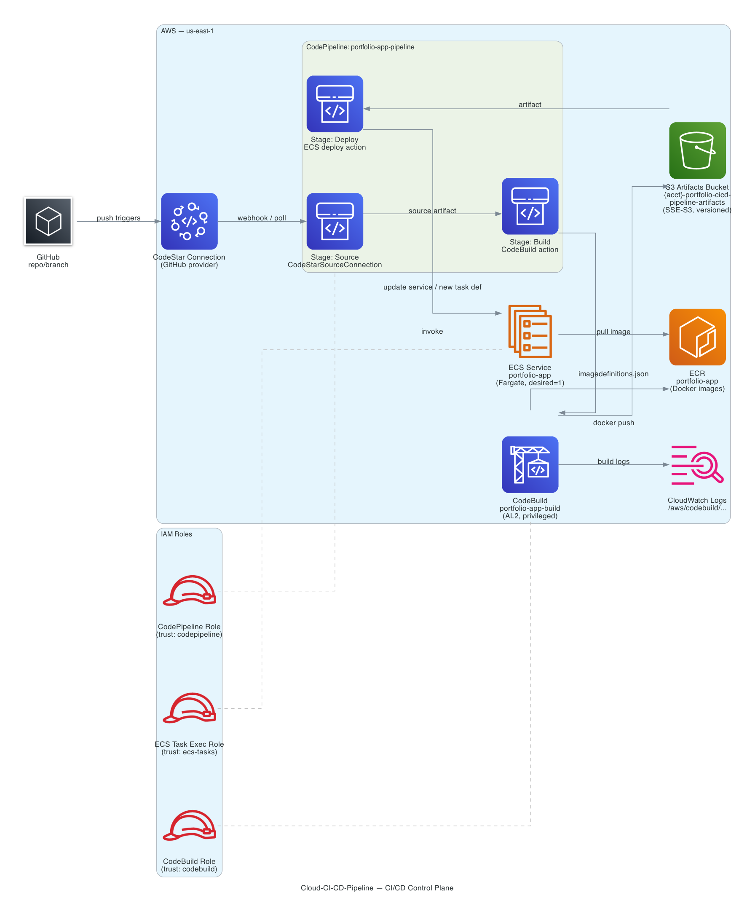

# AWS CI/CD Pipeline for Cloud Deployments

An end-to-end AWS pipeline that builds a containerized static site in CodeBuild, stores images in ECR, and rolls out new task definitions to ECS Fargate behind an Application Load Balancer whenever you push to GitHub—so the path from commit to live HTTP traffic is fully automated.


Section layout follows the portfolio README wireframe template: title and badges first, then architecture and how it works, key design decisions and AWS services, then prerequisites and deployment, screenshots, troubleshooting, learnings, and future work.

---

## Architecture

**CI/CD control plane** — GitHub push → CodeStar Connections → CodePipeline (source, build, deploy) → S3 artifact bucket, CodeBuild → ECR and CloudWatch Logs, deploy stage → ECS Fargate; IAM roles for CodePipeline, CodeBuild, and ECS task execution are shown in the diagram.



The diagram centers on the pipeline and container rollout. The ASCII overview below adds **Application Load Balancer** and **VPC** context (public ALB subnets, private task subnet, NAT).

```
GitHub (push to watched branch)
        │
        ▼
CodeStar Connections (authorized link to GitHub)
        │
        ▼
CodePipeline — Source stage (zip to S3 artifact bucket)
        │
        ▼
CodePipeline — Build stage
        │
        ▼
CodeBuild (docker build) ──▶ Amazon ECR (push image tags + latest)
        │
        │ imagedefinitions.json (artifact)
        ▼
CodePipeline — Deploy stage (ECS service force-new-deployment)
        │
        ▼
Amazon ECS (Fargate tasks in private subnet)
        │
        ▼
Application Load Balancer (HTTP :80) ──▶ internet

Supporting: VPC (public subnets for ALB, private subnet for tasks),
NAT gateway (task egress), S3 (pipeline artifacts), IAM (pipeline/build/task roles),
CloudWatch Logs (build + task logs).
```

---

## How it works

1. **Trigger** — You push (or merge) to the GitHub branch configured in Terraform (`github_branch`, default `main`). Nothing runs until CodePipeline’s source stage sees new commits on that branch.

2. **Source** — CodePipeline uses a **CodeStar Connections** source action to pull the repo. The connection must exist and be in an *Available* state in the AWS console before the pipeline can succeed. Stage output (source zip) lands in the **S3** artifact bucket.

3. **Build** — **CodeBuild** runs `buildspec.yml`: logs into **ECR**, builds the `Dockerfile` (Nginx serving `website/`), tags the image with `CODEBUILD_RESOLVED_SOURCE_VERSION` and `latest`, pushes both to **ECR**, and writes `imagedefinitions.json` naming the ECS container `app` and the pushed image URI.

4. **Deploy** — The deploy stage applies that artifact to the **ECS** service on **Fargate**. ECS pulls the new image from ECR, starts tasks in the private subnet, registers them with the **ALB** target group, and drains old tasks after health checks pass.

5. **User-facing result** — The **Application Load Balancer** DNS name serves the static site over HTTP on port 80. After `terraform apply`, use the `application_url` output (see `terraform/outputs.tf`) as the bookmarkable entry point.

---

## Key design decisions

### 1. Simpler network layout instead of full multi-AZ HA

The VPC uses two public subnets (for the ALB) but a **single private application subnet and one NAT gateway** so the project stays centered on **CI/CD behavior**, not redundant NAT and subnet sprawl. A production system would spread tasks and NAT across AZs; here the tradeoff is cost and complexity versus demo clarity.

### 2. GitHub via CodeStar Connections (not CodeCommit mirroring)

**CodeStar Connections** keeps the pipeline’s source of truth on GitHub while using a first-class AWS integration, so Terraform can reference a connection ARN and repository id without maintaining a duplicate repo or webhook machinery.

### 3. Fargate for the ECS service

**Fargate** removes EC2 capacity and patching from the story: the interesting parts are pipeline → image → service update, not cluster Auto Scaling groups.

### 4. ALB + target group health checks as the gate

Traffic only shifts to new tasks after the **ALB** marks targets healthy. That ties deployment success to something observable (HTTP health) rather than only “task started.”

### 5. One Terraform root for the full stack

VPC, ECR, ECS, ALB, pipeline, artifact bucket, and IAM live in one apply so a reviewer can see the **entire** dependency graph in one place. The tradeoff is a larger state file than split workspaces; for a portfolio-sized footprint that was acceptable.

---

## AWS services used

- **Amazon VPC** — Isolated network; public subnets for the ALB, private subnet for ECS tasks.
- **NAT gateway** — Outbound internet for Fargate tasks (e.g. image pulls) from the private subnet.
- **Amazon ECS** — Runs the service on **Fargate** with an ALB-attached service.
- **Amazon ECR** — Stores images built and pushed by CodeBuild.
- **AWS CodePipeline** — Orchestrates source, build, and deploy stages.
- **AWS CodeBuild** — Builds and pushes the Docker image; produces `imagedefinitions.json` for ECS.
- **Amazon S3** — Pipeline stage artifacts (source output, build output).
- **AWS CodeStar Connections** — Authorized GitHub link for the CodePipeline source action.
- **Elastic Load Balancing (ALB)** — HTTP listener and target group in front of the service.
- **IAM** — Roles for CodeBuild, CodePipeline, ECS task execution, and task/runtime permissions.
- **Amazon CloudWatch Logs** — CodeBuild logs and ECS task logs.

---

## Prerequisites

### Required tools

- **AWS CLI** v2.x — [Installation guide](https://docs.aws.amazon.com/cli/latest/userguide/getting-started-install.html)
- **Terraform** >= 1.6.0 — [Installation guide](https://developer.hashicorp.com/terraform/downloads)
- **Docker** (for local image experiments; CodeBuild runs Docker in AWS) — [Installation guide](https://docs.docker.com/get-docker/)

### AWS account requirements

- AWS credentials configured (`aws configure` or equivalent). This project is intended for **us-east-1** (see `buildspec.yml` and provider configuration in Terraform).
- IAM permissions sufficient to create and update: VPC, ECS, ECR, CodePipeline, CodeBuild, S3, ALB, IAM roles/policies, CodeStar Connections–related pipeline resources, and CloudWatch Logs.

### External requirements

- A **CodeStar Connections** GitHub connection created and **completed** (status Available) in the AWS console (**Developer Tools → Settings → Connections**). Copy its ARN into `terraform.tfvars`.
- A GitHub repository whose id (`owner/name`) matches `github_repository_id`.

---

## Setup and deployment

### 1. Clone the repository

```bash
git clone <repo-url>
cd Cloud-CI-CD-Pipeline
```

### 2. Configure variables

```bash
cp terraform/terraform.tfvars.example terraform/terraform.tfvars
# Edit terraform/terraform.tfvars: codestar_connection_arn, github_repository_id, and optionally github_branch
```

### 3. Deploy infrastructure

```bash
cd terraform
terraform init
terraform plan
terraform apply
```

### 4. After apply

- Note outputs such as `application_url`, `ecr_repository_url`, and `codepipeline_name` (see `terraform/outputs.tf`).
- Trigger the pipeline by pushing to the watched branch, or start an execution in the CodePipeline console.

**Console-only:** If the CodeStar connection is still pending, approve/link it in the AWS console before expecting the source stage to succeed.

### Terraform variables

| Variable | Description | Default |
| --- | --- | --- |
| `codestar_connection_arn` | ARN of the CodeStar Connections GitHub connection (must be Available). | Required |
| `github_repository_id` | Repo as `owner/name` for the pipeline source. | Required |
| `github_branch` | Branch the pipeline watches. | `main` |

---

## Screenshots

### VPC resource map

Shows the simplified layout (public subnets for the ALB, private side for workloads) used for this CI/CD demo.


### Application Load Balancer

The ALB is the HTTP entry point and forwards to the ECS-backed target group.


### Target group health

Confirms the ECS task is registered and passing health checks.


### ECS cluster overview

Cluster hosting the service and running task.


### ECS service overview

Active deployment, task, and ALB integration.


### Amazon ECR repository

Images produced by CodeBuild after pipeline runs.


### CodePipeline execution

Successful source, build, and deploy stages end-to-end.


### Live application

Static site served over HTTP at the ALB DNS name (`Dockerfile` copies `website/` into the Nginx image).


---

## Troubleshooting

### CodePipeline source stage fails with connection / repository errors

**Root cause:** The CodeStar connection is not **Available**, or the `github_repository_id` / branch does not match the connected account/repo.

**Fix:** In the AWS console, open **Developer Tools → Settings → Connections**, finish authorization, then confirm `codestar_connection_arn` and `github_repository_id` in `terraform.tfvars` match that connection and repo. Re-run the pipeline.

### ECS tasks run but targets stay unhealthy on the ALB

**Root cause:** Often security group rules (ALB ↔ task port), wrong container port mapping, or the app not listening on the port the target group expects.

**Fix:** Verify the task definition container port matches the target group port; ensure the ALB security group can reach the task security group on that port; check **CloudWatch Logs** for the service task for startup errors.

### CodeBuild fails on ECR login or docker push

**Root cause:** The CodeBuild service role may lack ECR permissions, or the repository URI/account in `buildspec.yml` does not match the account where the pipeline runs.

**Fix:** Confirm IAM policies attached to the CodeBuild project role allow `ecr:GetAuthorizationToken` and push actions to the `portfolio-app` repository; confirm `aws sts get-caller-identity` in the build matches the account that owns the ECR repo.

---

## What I learned

- How **CodePipeline** ties **CodeStar Connections**, **S3 artifacts**, **CodeBuild**, and **ECS** into one execution graph—and how a failed source connection blocks everything downstream with little surface area in Terraform alone.
- The difference between **ECS task execution roles** (pull image, write logs) and **task roles** (what the app can call at runtime), and why mixing them up shows up as pull or AWS API failures rather than “build broke.”
- Why **imagedefinitions.json** must align with the **container name** in the task definition (`app` in this project); a name mismatch produces a deploy stage that “succeeds” in the console but never rolls the image you built.
- How **ALB target group health checks** behave as the real gate for traffic during rolling deployments, and how to trace failures from “unhealthy target” back to security groups or listen ports.

---

## Future improvements

- HTTPS with **ACM** on the ALB and optional **Route 53** custom domain.
- Multiple private application subnets and NAT per AZ for **true** multi-AZ resilience.
- Separate **staging** and **production** pipelines or environments with promotion gates.
- **Blue/green** or canary ECS deployments instead of rolling-only updates.
- Extra pipeline stages (lint, tests, or IaC validation) before the build or deploy.

---

## Project structure

```text
.
├── website/                       # Static HTML/CSS copied into the container image
├── images/                        # README screenshots
├── scripts/                       # Optional local helpers (e.g. Terraform + Docker/ECR)
├── terraform/                     # Full IaC: VPC, networking, SGs, ECR, ECS, ALB, pipeline, CodeBuild, IAM, S3
│   ├── terraform.tfvars.example   # Sample variables (copy to terraform.tfvars; keep secrets local)
│   ├── outputs.tf                 # ALB URL, ECR URL, pipeline names, etc.
│   └── .terraform.lock.hcl        # Provider lock for reproducible init
├── Dockerfile                     # Nginx image bundling website/
├── buildspec.yml                  # CodeBuild: build/push to ECR, emit imagedefinitions.json
└── README.md
```
